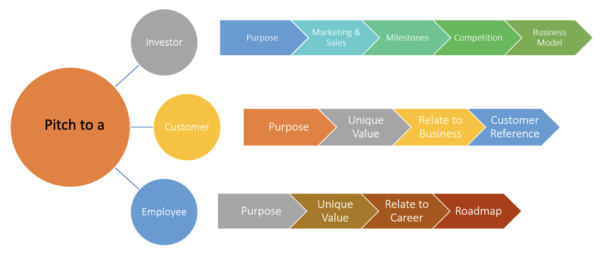

## Why

A great product should have supporters. Effective communication is essential to gain the support of different stakeholders (customers, investors, employees, etc.). A pitch event is an excellent opportunity to introduce a product to potential investors, customers, as well as to receive valuable feedback from the stakeholders.

## How

The different forms of pitching.

1. Elevator pitch
2. Live plan pitches

### Elevator pitch

An Elevator pitch is the very first meeting with a potential customer or investor. It must be concise and spark the curiosity of the individual regarding the product. At the same time, it must encourage them to ask more questions. Here are some tips for an elevator pitch:

1. Grab the attention
2. Spark curiosity
3. Summarize the purpose of the product
4. Encourage to ask questions
5. Be prepared with a business card

### Live plan pitch

The live plan pitch is a more detailed pitching strategy and its content differs based on your audience.

### Type of Stakeholders

  

#### For an investor,

1.  Purpose of the product

    - Should include the problems that will be solved by your product 

    - Success stories of existing customers

2.  Marketing and sales

    - Target customers

    - Cost of acquiring customers

    - Growth and forecasted future revenue (In the case of existing customers)

3.  Milestones

    -     Include future business plans such as target customer acquisitions, partnerships with other parties. State these milestones along with timestamps.

4.  Competition

    -     Express what is unique and new in the product (Unique value proposition)

    -     Present a comparison with existing competitor products

5.  Business model

    - Every investor is keen on revenue stream and cashflows. A detailed description regarding cashflows should be included along with the time frame.

#### For a customer,

A potential customer is keen to understand how their pain points are addressed. Instead of just illustrating planned or existing features, relate how product features could address their needs. Emphasize the unique value your product provides just don’t make it about the price. Offer early signup to lock in your customer from the start. Details of existing customers are plus points to attract new customers when pitching a product.

#### For an employee,

When pitching to onboard a potential employee, it’s important to communicate the purpose of the product and see who is attracted to this rather than a mere paycheck. It’s also important to illustrate the future roadmap and how it grooms a person’s career and potential equity options.

## References

- [When Pitching Investors, Your Product Doesn't Matter](https://www.entrepreneur.com/article/322361)
- [Creating a pitch for various stakeholders](https://fi.co/insight/creating-an-elevator-pitch-that-attracts-investors-customers-and-more)
