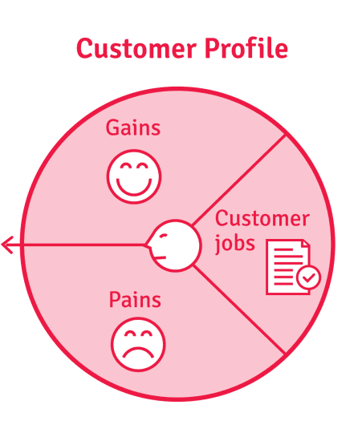
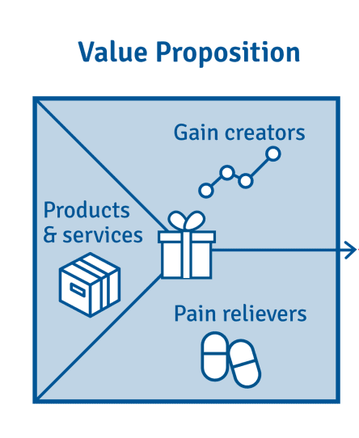
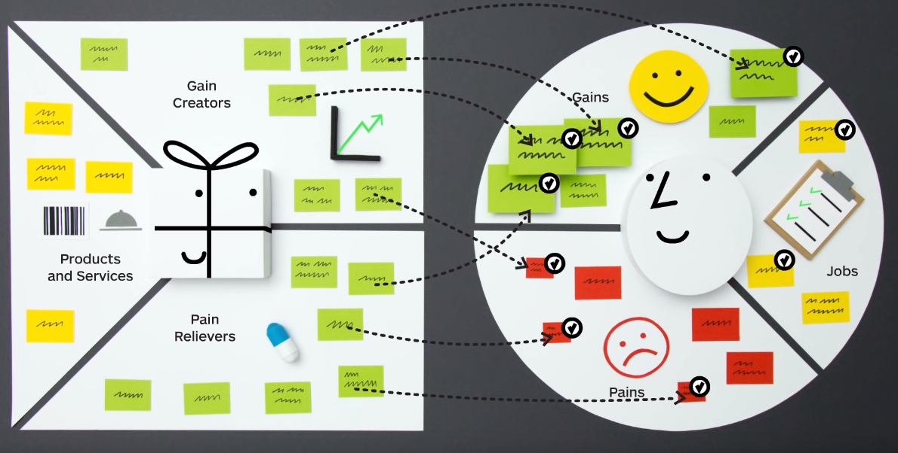

## What

_The primary value that the company promises to deliver to customers. This is the declaration of intent or company's brand statement to consumers to communicate what the company stands for, how it operates, and why it deserves their sale._

## Why

A product or service is introduced to the market to provide a solution for a problem. It is very much required to understand what sort of tasks are to being sought by the targeted audience, the pains currently faced, and what gains and how they measure it. On the other hand, it is essential to identify the products and services currently been offered, how those provide relief to the pains faced by the audience, and how those could extend the gains required by them. 

However, According to the research by Simon Kucher & Partners 2014, it is proved that over 72% of new products and services introduced to the market fail. Customers reject nearly 7 out of 10 new products and services launched to the market. The reason is for not being able to cater to the pain points faced by the targeted audience. Therefore it is essential to identify the value map for the products or services offered. The Value Proposition Canvas is widely used for this purpose, and when a proper link is built between the pains and the pain relievers provided, it is considered that the Product-Market fit has been achieved. 

However, it is important to note that, even though a proper Product-Market fit is made, the business may fail if the business model is flawed.

## How

In a Value Proposition Canvas, there are two segments.

1. **The Customer Profile :** Portrays the tasks the target audience requires to do, the pain points and the gains & how gains are measured.
	1. Tasks
	2. Pain points
	3. Gains

2. **Value Map :** Portrays the products and services offered, the pain relievers offered and the gain creators for the targeted audience.
	1. Products & Services
	2. Pain relievers
	3. Gain creators

When the segments are identified, the mapping is reviewed by matching the pains and pain relievers, the gains, and the gain creators offered via the products and services to make the tasks of the targeted audience easy. 

Following is an image connecting the Value Map with the Customer Profile items.

## References
- [Strategyzer's Value Proposition Canvas Explained](https://www.youtube.com/watch?v=ReM1uqmVfP0)
- [Press : Simon Kucher & Partners 2014](https://www.simon-kucher.com/sites/default/files/simon-kucher_global_pricing_study_2014.pdf)
- [Value Proposition Canvas Explained](https://www.youtube.com/watch?v=aN36EcTE54Q)
- [What is the Value Proposition Canvas?](https://www.b2binternational.com/research/methods/faq/what-is-the-value-proposition-canvas/)
- [Value Proposition](https://www.investopedia.com/terms/v/valueproposition.asp)