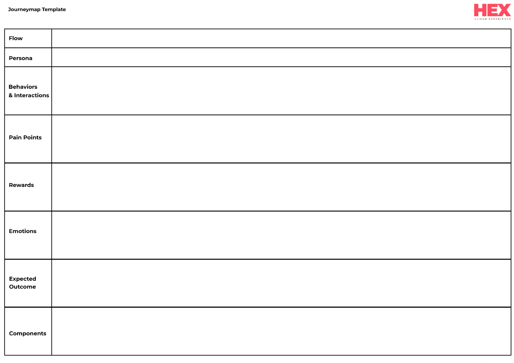

  

## Why
Better user-experience leads to better customer retention. A user journey map is a tool to visualize the user interaction with a product. It helps you to see your product from a user's point of view and follow a more user-centric approach in the product design.   

## How
Consider the following when creating a user journey map. Use customer narratives and customer data to plot their expertise over time, mapping what they are doing, thinking, and feeling, while interacting with them along the way.

- Identify the User Flows.
  - The steps the user takes to achieve goals. It can be the primary or sub-flows. It will be a series of activities.

- The Persona which interacts with the journey.
  - What personas interact with the main journey at a certain point.

- The Behaviors & Interactions of the particular user.
  - What the Persona does for a specific step. What are the actions taken by them?

- The Pain points.
  - What the hardships/obstacles the persona has to go through to achieve a goal.

-  Rewards presented to the user.
  - What are the incentives given to the user to overcome pain points?

- The Emotions, a user might feel at this point.
  - What kind of emotions the user might get at a particular step. 

- The Expected Outcome.
  - If all things go well, what would be the expected result of the specific actions you are focusing on. 

- The Web Components.

  - The UI components which can be used in the interface. That may be updated at any time in the process.

### Supporting flows 
What journey maps and customer narratives don't show is the organization's internal workings to offer the product or service. The supporting flows uncover and documents everything that goes on beneath the surface and the internal makeup of the organization that creates it. It is a data visualization of how your product or service works, the business logic workings of how customer experiences are produced. e.g.: Business logic to select the best cab for a taxi hailing app.

## References

- [Journey Mapping 101](https://www.nngroup.com/articles/journey-mapping-101/)
- [ How to create customer journey maps](https://www.nngroup.com/articles/customer-journey-mapping/)
- [Service Blueprints: Definition](https://www.nngroup.com/articles/service-blueprints-definition/)
- [Service Blueprinting in Practice: Who, When, What](https://www.nngroup.com/articles/service-blueprinting-practice/)
- [What Is a Service Blueprint?: Designing a Seamless Service Process](https://www.lucidchart.com/blog/what-is-a-service-blueprint)
- [How to Create a Customer Journey Map](https://www.lucidchart.com/blog/how-to-build-customer-journey-maps)
- [How to Create an Effective Customer Journey Map [Examples + Template]](https://blog.hubspot.com/service/customer-journey-map)
